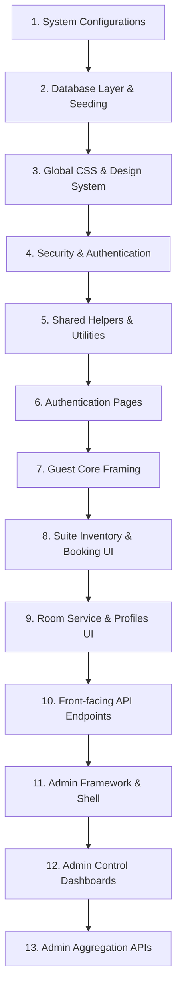

# Auralis Hotel — Development Flow & Code Execution Trace

This document provides a comprehensive step-by-step breakdown of the development sequence and the complete runtime call graph for every single file in the **Auralis Hotel Management System** codebase.

---

## Part 1: Step-by-Step Development Sequence

The development flow moves from initial environment configurations to the database layer, global styles, core security, shared libraries, guest-facing interfaces, backend endpoints, and finally, the administrative console.



### 1. System Configurations
Establishing the compiler parameters, modules, package requirements, lint structures, and secure environment vaults.

* **[package.json](file:///c:/Ai%20powered%20hotel%20management%20system/auralis-hotel/package.json)**
  * **Role**: Configures the project's node dependencies (Next.js 16.2, React 19.2, NextAuth, Prisma, Nodemailer, Lucide Icons, Framer Motion, Recharts) and exports dev, build, start, and lint scripts.
* **[next.config.mjs](file:///c:/Ai%20powered%20hotel%20management%20system/auralis-hotel/next.config.mjs)**
  * **Role**: Configures specific compilation controls for the Next.js runtime environment.
* **[eslint.config.mjs](file:///c:/Ai%20powered%20hotel%20management%20system/auralis-hotel/eslint.config.mjs)**
  * **Role**: Enforces code style, layout guidelines, and validation structures.
* **[jsconfig.json](file:///c:/Ai%20powered%20hotel%20management%20system/auralis-hotel/jsconfig.json)**
  * **Role**: Defines compiler path mapping rules, binding the `@/*` shorthand directly to the `./src` directory.
* **[.env / .env.local](file:///c:/Ai%20powered%20hotel%20management%20system/auralis-hotel/.env)**
  * **Role**: Secure credentials vault holding the DB connect string (`DATABASE_URL`), OAuth client secrets, mail keys, and the NextAuth system salt.
* **[favicon.ico](file:///c:/Ai%20powered%20hotel%20management%20system/auralis-hotel/src/app/favicon.ico)**
  * **Role**: Brand visual node displayed inside client browser tabs.

---

### 2. Database Layer & Seeding
Designing schema relations and writing initialization engines to populate default states.

* **[schema.prisma](file:///c:/Ai%20powered%20hotel%20management%20system/auralis-hotel/prisma/schema.prisma)**
  * **Role**: Defines the PostgreSQL entity models:
    * `User`: Guest/Admin profiles.
    * `Account` & `Session`: NextAuth adapters.
    * `Room`: Hotel suite records (type, capacity, floor, status, bed details).
    * `Booking`: Guest suite reservations with check-in/out timestamps and total cost.
    * `FoodItem`: Kitchen menu entries.
    * `FoodOrder`: Room service tickets.
* **[prisma.js](file:///c:/Ai%20powered%20hotel%20management%20system/auralis-hotel/src/lib/prisma.js)**
  * **Role**: Exports a single, shared instance of `PrismaClient` to prevent connection resource leaks during rapid code recompiles in development.
* **[seed.js](file:///c:/Ai%20powered%20hotel%20management%20system/auralis-hotel/prisma/seed.js)**
  * **Role**: Automatically populates the PostgreSQL database with default guest suites, room service menus, and an Admin testing profile.

---

### 3. Global CSS & Design System
Creating standard classes for layouts, glass effects, animations, and high-fidelity typography.

* **[globals.css](file:///c:/Ai%20powered%20hotel%20management%20system/auralis-hotel/src/app/globals.css)**
  * **Role**: Defines the entire visual brand identity. Uses variables for standard colors (luxury Navy, Gold, Warm Slate), typography styles (Cormorant Garamond, Inter), responsive grids, buttons, tables, custom-designed modal overlays, skeleton loadings, and hover transitions.

---

### 4. Security & Authentication Setup
Configuring login handlers, session states, and server-side route guards.

* **[auth.js](file:///c:/Ai%20powered%20hotel%20management%20system/auralis-hotel/src/lib/auth.js)**
  * **Role**: Standard auth policy config. Connects the Credentials Provider (bcrypt password parsing) and Google Provider. Serializes user role payloads (`ADMIN`, `GUEST`) and database IDs directly into the encrypted JWT token.
* **[route.js (NextAuth handler)](file:///c:/Ai%20powered%20hotel%20management%20system/auralis-hotel/src/app/api/auth/%5B...nextauth%5D/route.js)**
  * **Role**: Generates NextAuth's backend routes (`/api/auth/signin`, `/api/auth/callback`, `/api/auth/session`) using the master config options.
* **[AuthProvider.jsx](file:///c:/Ai%20powered%20hotel%20management%20system/auralis-hotel/src/components/AuthProvider.jsx)**
  * **Role**: Client-side context provider wrapping the application in React’s session states.
* **[layout.js (Root layout)](file:///c:/Ai%20powered%20hotel%20management%20system/auralis-hotel/src/app/layout.js)**
  * **Role**: The main application page wrapper. Sets custom metadata, applies standard fonts, imports custom styles, and mounts the authorization wrapper alongside global notifications (`react-hot-toast`).
* **[middleware.js](file:///c:/Ai%20powered%20hotel%20management%20system/auralis-hotel/src/middleware.js)**
  * **Role**: Intercepts server-side route requests. Protects `/admin/:path*` (admin-only) and `/profile/:path*` / `/food/:path*` (login required). Safely redirects unauthorized requests.

---

### 5. Shared Helpers & Utilities
Shared business modules utilized across client pages and server-side route controllers.

* **[utils.js](file:///c:/Ai%20powered%20hotel%20management%20system/auralis-hotel/src/lib/utils.js)**
  * **Role**: Common utility helper file. Houses standard monetary calculators (`formatCurrency`), date difference counters, and CSS class-combiner functions.
* **[email.js](file:///c:/Ai%20powered%20hotel%20management%20system/auralis-hotel/src/lib/email.js)**
  * **Role**: Creates and dispatches automated, custom HTML reservation records, booking logs, and receipt summaries using `nodemailer`.
* **[route.js (Email Trigger API)](file:///c:/Ai%20powered%20hotel%20management%20system/auralis-hotel/src/app/api/email/route.js)**
  * **Role**: Exposes a POST endpoint allowing authorized users or backend tasks to manually trigger administrative emails.

---

### 6. Authentication Pages
User registration and authorization forms.

* **[route.js (Register API)](file:///c:/Ai%20powered%20hotel%20management%20system/auralis-hotel/src/app/api/auth/register/route.js)**
  * **Role**: Accepts registration details, checks for duplicate accounts, hashes raw passwords using `bcryptjs`, and saves a new Guest record to the database.
* **[register/page.jsx](file:///c:/Ai%20powered%20hotel%20management%20system/auralis-hotel/src/app/%28auth%29/register/page.jsx)**
  * **Role**: Guest sign-up view that validates information and posts user data to the registration endpoint.
* **[login/page.jsx](file:///c:/Ai%20powered%20hotel%20management%20system/auralis-hotel/src/app/%28auth%29/login/page.jsx)**
  * **Role**: Portal landing requesting credentials. Authenticates users through NextAuth and redirects them based on their roles.

---

### 7. Guest Core Framing
Creating the responsive outer layout structure for all customer-facing views.

* **[Navbar.jsx](file:///c:/Ai%20powered%20hotel%20management%20system/auralis-hotel/src/components/customer/Navbar.jsx)**
  * **Role**: Fixed-header navigation bar. Displays navigation routes, active user session details, context-based actions, and a link to the admin panel for staff.
* **[Footer.jsx](file:///c:/Ai%20powered%20hotel%20management%20system/auralis-hotel/src/components/customer/Footer.jsx)**
  * **Role**: Dynamic footer detailing hotel history, locations, booking links, and contacts.
* **[layout.jsx (Customer Layout)](file:///c:/Ai%20powered%20hotel%20management%20system/auralis-hotel/src/app/%28customer%29/layout.jsx)**
  * **Role**: Groups all customer pages, rendering the layout framing (Navbar, children, Footer) consistently.

---

### 8. Suite Inventory & Booking UI
Presenting hotel suites, checking availability, and creating room reservations.

* **[HeroSection.jsx](file:///c:/Ai%20powered%20hotel%20management%20system/auralis-hotel/src/components/customer/HeroSection.jsx)**
  * **Role**: High-fidelity landing banner featuring luxury background graphics and custom action buttons.
* **[TestimonialsSection.jsx](file:///c:/Ai%20powered%20hotel%20management%20system/auralis-hotel/src/components/customer/TestimonialsSection.jsx)**
  * **Role**: Interactive carousel showcasing guest reviews.
* **[page.jsx (Customer Landing)](file:///c:/Ai%20powered%20hotel%20management%20system/auralis-hotel/src/app/%28customer%29/page.jsx)**
  * **Role**: Home landing page combining the Hero Section, testimonials, hotel details, and quick links.
* **[RoomCard.jsx](file:///c:/Ai%20powered%20hotel%20management%20system/auralis-hotel/src/components/customer/RoomCard.jsx)**
  * **Role**: Renders a clean card interface for each suite, showing room rates, bed type, size specifications, and availability tags.
* **[rooms/page.jsx](file:///c:/Ai%20powered%20hotel%20management%20system/auralis-hotel/src/app/%28customer%29/rooms/page.jsx)**
  * **Role**: Catalog of available suites. Features dynamic category filtering (Suite, Deluxe, Standard) and price range controls.
* **[rooms/[id]/page.jsx](file:///c:/Ai%20powered%20hotel%20management%20system/auralis-hotel/src/app/%28customer%29/rooms/%5Bid%5D/page.jsx)**
  * **Role**: Suite detailed view. Displays amenities, gallery, check-in validation calendar, and handles reservation requests.

---

### 9. Room Service & Profiles UI
Interactive client views handling dining orders and personal histories.

* **[FoodCard.jsx](file:///c:/Ai%20powered%20hotel%20management%20system/auralis-hotel/src/components/customer/FoodCard.jsx)**
  * **Role**: Dynamic card displaying food description, price, classification badge, and an interactive "Add to Cart" selector.
* **[food/page.jsx](file:///c:/Ai%20powered%20hotel%20management%20system/auralis-hotel/src/app/%28customer%29/food/page.jsx)**
  * **Role**: Multi-tab menu view (Breakfast, Lunch, Dinner, Drinks). Includes a slide-out cart drawer and an action button to submit room service orders.
* **[profile/page.jsx](file:///c:/Ai%20powered%20hotel%20management%20system/auralis-hotel/src/app/%28customer%29/profile/page.jsx)**
  * **Role**: Logged-in customer panel displaying check-in schedules, current room status, and food order histories.

---

### 10. Front-Facing API Endpoints
Core backend logic and endpoints for customer pages.

* **[route.js (Rooms Controller API)](file:///c:/Ai%20powered%20hotel%20management%20system/auralis-hotel/src/app/api/rooms/route.js)**
  * **Role**: Services `GET` (delivers filtered suite listings) and `POST` (creates new booking logs inside the DB).
* **[route.js (Room Specs API)](file:///c:/Ai%20powered%20hotel%20management%20system/auralis-hotel/src/app/api/rooms/%5Bid%5D/route.js)**
  * **Role**: Exposes endpoints to retrieve specific room details (`GET`), update description/pricing details (`PUT`), or delete records (`DELETE`).
* **[route.js (Menu Controller API)](file:///c:/Ai%20powered%20hotel%20management%20system/auralis-hotel/src/app/api/food/route.js)**
  * **Role**: Returns all dining options (`GET`) and accepts new menu items (`POST`).
* **[route.js (Food Specs API)](file:///c:/Ai%20powered%20hotel%20management%20system/auralis-hotel/src/app/api/food/%5Bid%5D/route.js)**
  * **Role**: Processes details updates (`PUT`) or removal requests (`DELETE`) for individual menu items.
* **[route.js (Orders Endpoint API)](file:///c:/Ai%20powered%20hotel%20management%20system/auralis-hotel/src/app/api/food-orders/route.js)**
  * **Role**: Logs guest food orders (`POST`) and retrieves order history logs for the active profile (`GET`).

---

### 11. Admin Framework & Shell
Structuring the dashboard environment for administrative tools.

* **[Sidebar.jsx](file:///c:/Ai%20powered%20hotel%20management%20system/auralis-hotel/src/components/admin/Sidebar.jsx)**
  * **Role**: Admin navigation panel. Features routing controls for reservation logs, suite inventory, dining operations, customer history, and performance reports.
* **[AdminHeader.jsx](file:///c:/Ai%20powered%20hotel%20management%20system/auralis-hotel/src/components/admin/AdminHeader.jsx)**
  * **Role**: Top-aligned navigation header showing system notifications, the current session, and an sign-out trigger.
* **[StatsCard.jsx](file:///c:/Ai%20powered%20hotel%20management%20system/auralis-hotel/src/components/admin/StatsCard.jsx)**
  * **Role**: Metric widgets displaying total profits, active stays, and dining metrics using custom layouts and brand colors.
* **[layout.jsx (Admin Layout)](file:///c:/Ai%20powered%20hotel%20management%20system/auralis-hotel/src/app/admin/layout.jsx)**
  * **Role**: Checks permissions and assembles the administrative console layout, placing the `Sidebar`, top `AdminHeader`, and viewable controls.

---

### 12. Admin Control Dashboards
Panels designed for processing stays, updating pricing, and tracking operational metrics.

* **[page.jsx (Admin Landing)](file:///c:/Ai%20powered%20hotel%20management%20system/auralis-hotel/src/app/admin/page.jsx)**
  * **Role**: Interactive command console showing monthly analytical summaries, active kitchen tickets, current guest rosters, and quick status metrics.
* **[bookings/page.jsx (Admin Bookings)](file:///c:/Ai%20powered%20hotel%20management%20system/auralis-hotel/src/app/admin/bookings/page.jsx)**
  * **Role**: Searchable reservation registry. Provides administrative options for booking processing, including **Check-In**, **Check-Out**, and **Cancel Stay**.
* **[rooms/page.jsx (Admin Rooms)](file:///c:/Ai%20powered%20hotel%20management%20system/auralis-hotel/src/app/admin/rooms/page.jsx)**
  * **Role**: Manage room inventory details. Admins can update floor assignments, toggle rooms offline for maintenance (`MAINTENANCE`), edit pricing, or add new suites.
* **[food/page.jsx (Admin Menu)](file:///c:/Ai%20powered%20hotel%20management%20system/auralis-hotel/src/app/admin/food/page.jsx)**
  * **Role**: Staff kitchen queue manager. Houses controls to adjust menu prices, toggle dish availability, and update pending food orders (`PREPARING` -> `DELIVERED`).
* **[customers/page.jsx (Admin Customers)](file:///c:/Ai%20powered%20hotel%20management%20system/auralis-hotel/src/app/admin/customers/page.jsx)**
  * **Role**: Searchable guest directory showing registration dates, contact details, total expenditures, and booking history.
* **[reports/page.jsx (Admin Reports)](file:///c:/Ai%20powered%20hotel%20management%20system/auralis-hotel/src/app/admin/reports/page.jsx)**
  * **Role**: Renders business charts (monthly revenue, occupancy trends, popular food items) using Recharts.

---

### 13. Admin Aggregation APIs
Analytical background controllers calculating administrative details.

* **[route.js (Reports API Engine)](file:///c:/Ai%20powered%20hotel%20management%20system/auralis-hotel/src/app/api/reports/route.js)**
  * **Role**: Calculates and aggregates database data (gross booking profit, room occupancy percentages, average check-in time, popular menu orders) to drive charts.
* **[route.js (Customer Registry API)](file:///c:/Ai%20powered%20hotel%20management%20system/auralis-hotel/src/app/api/customers/route.js)**
  * **Role**: Delivers lists of registered users along with their billing totals.
* **[route.js (Customer Detail Admin API)](file:///c:/Ai%20powered%20hotel%20management%20system/auralis-hotel/src/app/api/customers/%5Bid%5D/route.js)**
  * **Role**: Exposes update endpoints (`PUT`) to modify user credentials or permissions, and delete actions (`DELETE`).

---

## Part 2: Runtime Execution Traces (Code Path Mapping)

This section traces exactly how code execution flows from file to file during key user interactions.

### Execution Path 1: Guest Registration & Secure Login

When a new user accesses Auralis Hotel, registers an account, and signs in, data flows through the files below:

```
[register/page.jsx]
        │  (Form submission)
        ▼
[api/auth/register/route.js] ────> [lib/prisma.js] ────> [PostgreSQL Database]
                                                                │
[login/page.jsx] <─── (Sign-in form) ───────────────────────────┘
        │
        ▼  (NextAuth authentication request)
[lib/auth.js] 
        │  (authorize credentials block, compare hash via bcrypt)
        ▼
[middleware.js] 
        │  (Checks decrypted session cookie & matching role token)
        ▼
[app/(customer)/page.jsx] OR [app/admin/page.jsx]
```

1. **Information Input**: The user enters their profile details on [register/page.jsx](file:///c:/Ai%20powered%20hotel%20management%20system/auralis-hotel/src/app/%28auth%29/register/page.jsx) and submits the form.
2. **Registration Request**: The registration page posts the form data to [route.js (Register API)](file:///c:/Ai%20powered%20hotel%20management%20system/auralis-hotel/src/app/api/auth/register/route.js).
3. **Database Insertion**: The API hashes the raw password using `bcryptjs` and queries the database using [prisma.js](file:///c:/Ai%20powered%20hotel%20management%20system/auralis-hotel/src/lib/prisma.js) to insert a new user with the default role of `GUEST`.
4. **User Authentication**: The user submits their credentials on [login/page.jsx](file:///c:/Ai%20powered%20hotel%20management%20system/auralis-hotel/src/app/%28auth%29/login/page.jsx), which passes them to the central NextAuth login handler.
5. **NextAuth Session Configuration**: NextAuth queries [auth.js](file:///c:/Ai%20powered%20hotel%20management%20system/auralis-hotel/src/lib/auth.js), which validates the email and matches the password hash. The token callback then bundles the user's role and database ID into the encrypted session JWT.
6. **Route Validation**: When the user requests a page, [middleware.js](file:///c:/Ai%20powered%20hotel%20management%20system/auralis-hotel/src/middleware.js) intercepts the request, reads the encrypted cookie, and routes the authenticated user to their target dashboard.

---

### Execution Path 2: Suite Inventory Browsing & Reservation Processing

When an authenticated guest views room options and book a suite, data flows through the files below:

```
[rooms/page.jsx] ────> [components/customer/RoomCard.jsx]
        │
        ▼  (Click Details)
[rooms/[id]/page.jsx] ────> [lib/utils.js] (computes booking totals)
        │
        ▼  (Submit Booking)
[api/rooms/route.js] ────> [lib/prisma.js] (creates Booking log, updates status)
        │
        ▼  (Send receipt notification)
[lib/email.js] ────> [nodemailer] ────> [Guest's Email Inbox]
```

1. **Retrieve Room Inventory**: The guest navigates to [rooms/page.jsx](file:///c:/Ai%20powered%20hotel%20management%20system/auralis-hotel/src/app/%28customer%29/rooms/page.jsx). The page calls the backend endpoint `GET /api/rooms` and renders available options using the animated [RoomCard.jsx](file:///c:/Ai%20powered%20hotel%20management%20system/auralis-hotel/src/components/customer/RoomCard.jsx) component.
2. **Review Details**: The guest clicks a room to open [rooms/[id]/page.jsx](file:///c:/Ai%20powered%20hotel%20management%20system/auralis-hotel/src/app/%28customer%29/rooms/%5Bid%5D/page.jsx), displaying amenities, dimensions, and floor plans.
3. **Select Dates**: The guest selects dates using the calendar. The page uses functions in [utils.js](file:///c:/Ai%20powered%20hotel%20management%20system/auralis-hotel/src/lib/utils.js) to compute stay length and total cost.
4. **Submit Booking**: Clicking **Book Room** triggers a POST request to [route.js (Rooms Controller API)](file:///c:/Ai%20powered%20hotel%20management%20system/auralis-hotel/src/app/api/rooms/route.js).
5. **Availability Verification**: The backend checks for booking conflicts. If the dates are open, it creates a `Booking` entry in the database via [prisma.js](file:///c:/Ai%20powered%20hotel%20management%20system/auralis-hotel/src/lib/prisma.js) with a status of `CONFIRMED` or `PENDING`.
6. **Dispatch Confirmation Email**: The API controller triggers the email handler [email.js](file:///c:/Ai%20powered%20hotel%20management%20system/auralis-hotel/src/lib/email.js) to format and send a booking receipt directly to the guest’s email.

---

### Execution Path 3: Dining Menu Room Service Order

When an active guest orders room service dining to their room, data flows through the files below:

```
[food/page.jsx] ────> [components/customer/FoodCard.jsx] (lists food items)
        │
        ▼  (Add items & review cart side-drawer)
[food/page.jsx] ────> [lib/utils.js] (formats pricing totals)
        │
        ▼  (Click 'Place Order')
[api/food-orders/route.js] ────> [lib/prisma.js] ────> [PostgreSQL Database]
                                                                │
[app/admin/food/page.jsx] <─── (real-time order updates) ───────┘
```

1. **Retrieve Dining Menu**: The guest navigates to [food/page.jsx](file:///c:/Ai%20powered%20hotel%20management%20system/auralis-hotel/src/app/%28customer%29/food/page.jsx). The page calls `GET /api/food` and displays available dishes using the [FoodCard.jsx](file:///c:/Ai%20powered%20hotel%20management%20system/auralis-hotel/src/components/customer/FoodCard.jsx) component.
2. **Add Items to Cart**: The guest adds items to their cart. The page uses formatting utilities in [utils.js](file:///c:/Ai%20powered%20hotel%20management%20system/auralis-hotel/src/lib/utils.js) to display price updates, item counts, and order summaries in the cart side-drawer.
3. **Submit Dining Order**: Clicking **Place Order** sends a POST request with the order details to [route.js (Orders Endpoint API)](file:///c:/Ai%20powered%20hotel%20management%20system/auralis-hotel/src/app/api/food-orders/route.js).
4. **Log Order**: The endpoint reads the user session and logs a `FoodOrder` entry (containing the items list, room number, total cost, and a status of `PENDING`) to the database using [prisma.js](file:///c:/Ai%20powered%20hotel%20management%20system/auralis-hotel/src/lib/prisma.js).
5. **Kitchen Notification**: The active order immediately appears on the kitchen staff dashboard at [food/page.jsx (Admin Menu)](file:///c:/Ai%20powered%20hotel%20management%20system/auralis-hotel/src/app/admin/food/page.jsx).

---

### Execution Path 4: Guest Check-in & System Analytics

When staff updates guest status (Check-in/Check-out) and views revenue analytics, data flows through the files below:

```
[admin/bookings/page.jsx] ────(Search and Select check-in)────> [api/rooms/[id]/route.js]
                                                                           │
                                                                           ▼
[PostgreSQL Database] <──── [lib/prisma.js] <──── (updates room/booking states)
         │
         ▼  (Fetch dashboard statistics)
[api/reports/route.js] ────> [lib/prisma.js] (aggregates room sales logs)
         │
         ▼  (Deliver analytics dataset)
[admin/reports/page.jsx] ────> [recharts] ────> [Admin Revenue Dashboard View]
```

1. **Staff Check-In Process**: Staff opens the searchable guest registry on [bookings/page.jsx (Admin Bookings)](file:///c:/Ai%20powered%20hotel%20management%20system/auralis-hotel/src/app/admin/bookings/page.jsx), locates the guest reservation, and clicks **Check-In**.
2. **Execute Booking Update**: The dashboard sends a PUT request to [route.js (Room Specs API)](file:///c:/Ai%20powered%20hotel%20management%20system/auralis-hotel/src/app/api/rooms/%5Bid%5D/route.js). The API updates the database using [prisma.js](file:///c:/Ai%20powered%20hotel%20management%20system/auralis-hotel/src/lib/prisma.js), setting the booking status to `CHECKED_IN` and the room status to `OCCUPIED`.
3. **Admin Dashboard Reporting**: An admin opens the reporting dashboard at [reports/page.jsx (Admin Reports)](file:///c:/Ai%20powered%20hotel%20management%20system/auralis-hotel/src/app/admin/reports/page.jsx) to view hotel analytics.
4. **Aggregate Analytics**: The dashboard page queries [route.js (Reports API Engine)](file:///c:/Ai%20powered%20hotel%20management%20system/auralis-hotel/src/app/api/reports/route.js). The API aggregates data from `Booking` and `FoodOrder` tables in PostgreSQL, calculating total revenue, average check-ins, occupancy percentages, and top menu items.
5. **Render Charts**: The API returns the calculated metrics, and the dashboard displays them in interactive charts using the Recharts library.
